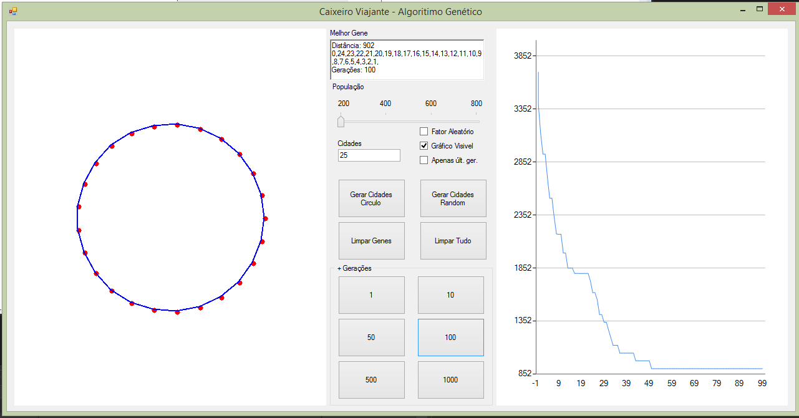
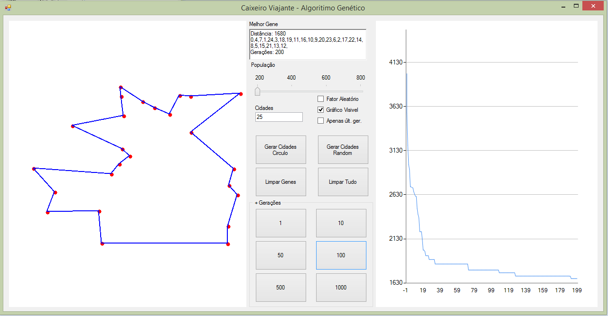

# CaixeiroViajante
Problema do Caixeiro Viajante resolvido usando algoritimo genético em C#

Essa é uma tentativa de resolver o clássico problema do caixeiro viajante sem utilizar bilbliotecas prontas, o algoritmo está quase 100%, mas as vezes ele apenas fica preso em alguns minimos locais.

Interface gráfica do projeto feita com WinForms

Gera cidades em círculo para testar o algorítimo, possui gráfico para acompanhar a menor distância percorrida de cada geração e mostra os dados do melhor gene.

Gera cidades de forma aleatória para simular um caso real.

# Sugestões para o futuro:

- Corrigir o problema dos minimos locais;
- Adicionar coordenadas de cidades reais e estradas reais.
